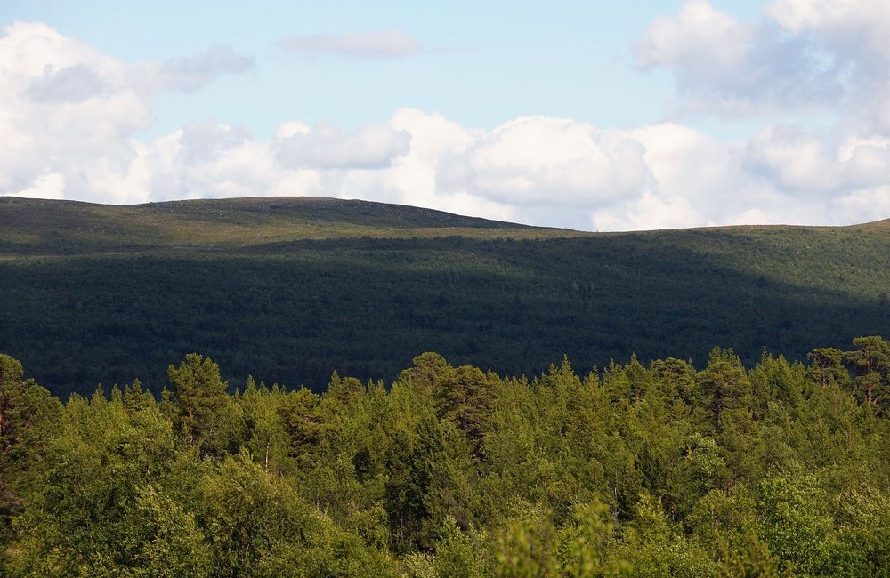

­**a tool that visualizes plans, flow and forecasts in Jira from different perspectives**

Sometimes it's hard to see the forest for all trees and sometimes we need to be able to study the leaves to solve a minor matter. The forest, with its trees and their leaves, is our common plan. JIRA contains the plan and allows us to walk around in the forest and look at the trees and also zoom in so we can see all the details of the leaves. That is not enough. We also need to be able to zoom out and see the forest to understand more of the whole.

> Scope360° helps us look at the forest or part of the forest from different perspectives.

|  Forest |  Trees |  Leaves |
