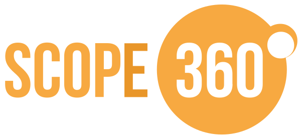

With different dimensions such as purpose, organization and time, the opportunity to answer ad-hoc questions arises. Questions like; When will a group of teams be ready to deliver a specific initiative and what does the progress look like. The core of each dimension is initiative, team and iteration, but can also be project, component, program, ART, solution, portfolio, program increment or something else.

It is the connection between JIRA issues together with these dimensions that identifies a scope that can be visualized in Scope360°.

The dimensions can be implemented in JIRA in different ways and usually some of them already exist. Scope360° does not depend on the dimensions being set in a special way in JIRA. See [About Dimensions View](/views/dimensions.html) for en example of dimensions.
