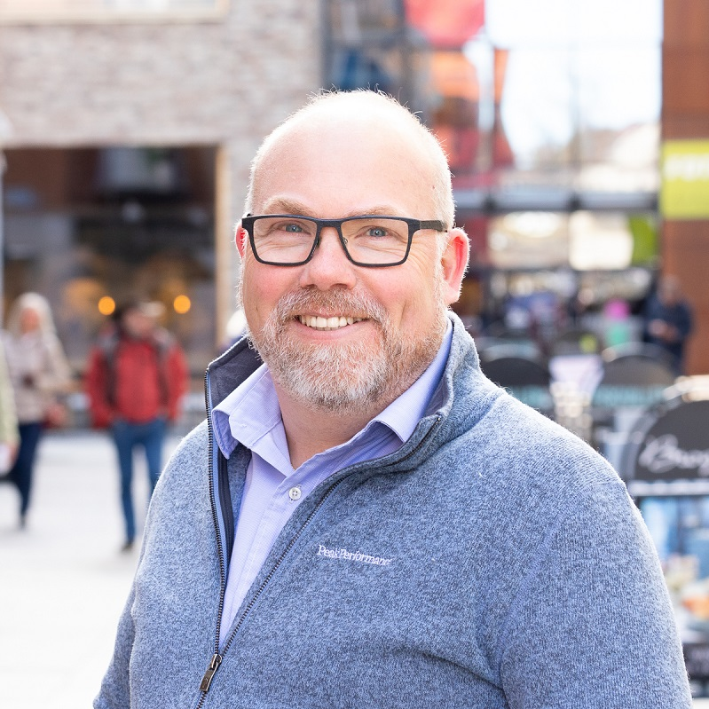

If you have any question or want to contact us, sen an email to **[SCOPE360.DEV@GMAIL.COM](mailto:SCOPE360.DEV@GMAIL.COM)**

Magnus and Tom have worked together in different ways since 2012. The journey of Scope360° started with a Chrome extension written by Magnus to enhance visualization in TFS and that work transformed into Jira Flow Companion.

Inspired by Magnus, Tom started to make visualizations of dependencies and that resulted in Jira Program Reports. A few years ago both tools had evolved and matured in a way that it made sense to combine them and **Scope360°** was born.

|  *Magnus Siverbrant, Agile Coach, Squeed* |  *Tom Mårdh, Agile Coach, Aliby* |
