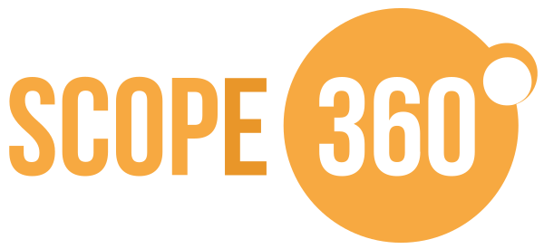

If you have any question or want to contact us, sen an email to **[info@scope360.se](mailto:info@scope360.se)**

As many great products. Scope360° came from frustration and a need for better views and tools, to plan better and create a model for constant updates.

Magnus and Tom have worked together in different ways since 2012. The journey of Scope360° started with a Chrome extension written by Magnus to enhance visualization in TFS and that work transformed into Flow Companion for Jira.

Inspired by Magnus, Tom started to make visualizations of dependencies and that resulted in a extension called Program Reports. A few years ago both tools had evolved and matured in a way that it made sense to combine them and **Scope360°** was born.

Togheter with Aliby - The pink company - they have gone from eight years of ”basement work” to a commersial product and a company. All energiezed by a partnership with born {digital.

|  |  | |
| | **Magnus Siverbrant** | **Tom Mårdh** |
