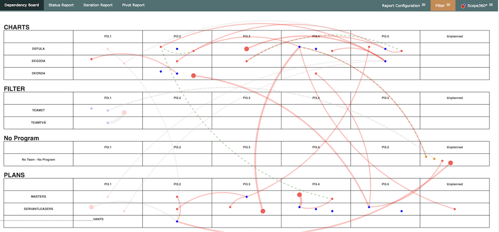
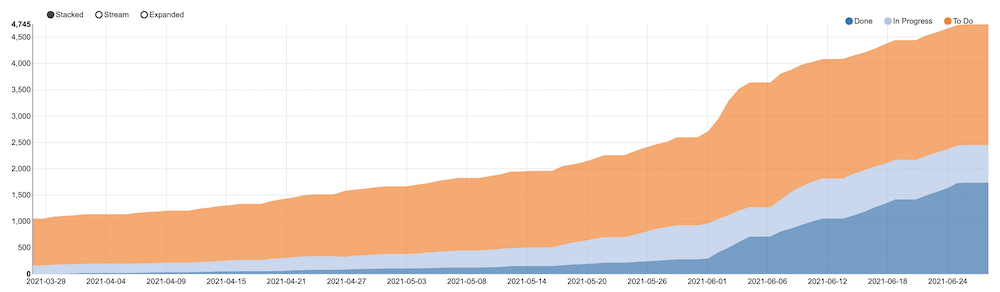
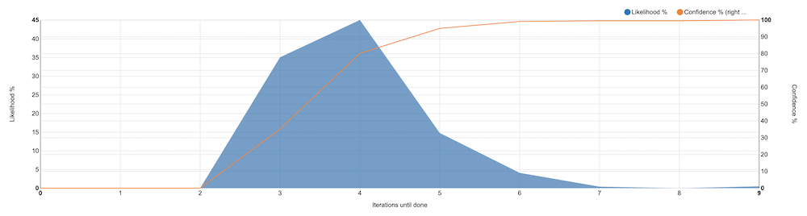

In addition to the three perspectives described briefly below, **Scope360°** offers assistance in improving the ability to navigate in JIRA as well as creating the queries needed to view the different perspectives.

| **Plan** | **Flow** | **Forecast** |
|  | |   |
| The plan is visualized through a number of views - **Dependency board** - shows which deliveries each team has planned, including dependencies to other teams - **Plan view** - shows the team’s plans iteration for iteration - **Status report** - gives a status overview measured in the number of issues in each JIRA epic that has status to do, in progress and done.  **[Learn more](perspectives/plan.html)** | The flow perspective provides different views of our capacity by visualizing the flow in terms of CFD, Throughput and lead times.   **[Learn more](perspectives/flow.html)** | Forecast is made by visualizing the outcome of a Monte Carlo simulation. The simulation uses previous throughput to calculate possible outcomes ahead and the result is a forecast based on historical data from the latest iterations.   **[Learn more](perspectives/forecast.html)** |
